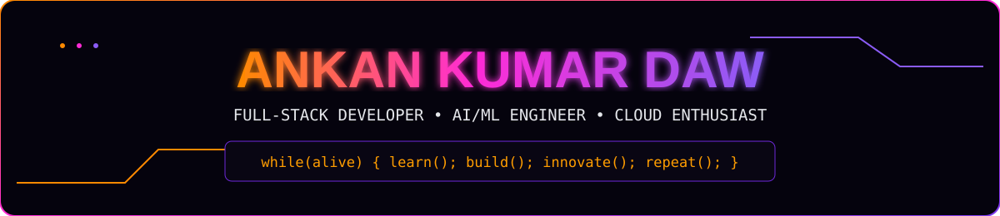

  

# Ankan Kumar Daw

 

  

Building practical software systems with intelligent features, scalable backends, and modern web technologies.

 

I'm a full-stack developer working across the MERN stack, Python, Spring Boot, and AWS — currently pursuing my MCA at Techno Main Salt Lake, after a BCA from NSHM College of Management & Technology.

I like taking a project from a blank repo to a fully working system — frontend interfaces, REST APIs, databases, ML models, and deployment — end to end, not just isolated pieces. Over the last couple of years that's meant building AI-assisted developer tooling, hospital and healthcare platforms, nutrition and fitness apps, computer-vision systems, staff-management tools, and IoT security automation.

I care more about understanding how a whole system fits together than about any single piece of code, which is why most of what I build spans the full stack — UI down to infrastructure.

 

 

These update automatically from GitHub — no need to touch this section again.

  

<table>
<tr>
<td width="50%">

**Full-Stack Systems**
Multi-role platforms with clean UIs, REST APIs, authentication, and production-oriented architecture.

</td>
<td width="50%">

**AI / Machine Learning**
Practical ML integrations — risk-prediction models, computer-vision pipelines, and Gemini-powered assistants.

</td>
</tr>
<tr>
<td width="50%">

**Backend Architecture**
REST APIs and services across Node.js/Express, Spring Boot, FastAPI, and PHP, backed by MongoDB, PostgreSQL, and MySQL.

</td>
<td width="50%">

**Cloud & DevOps**
Docker Compose multi-service stacks, AWS (S3, Lambda, SageMaker), Firebase, and CI-friendly project structure.

</td>
</tr>
</table>

 

LANGUAGES
 

WEB & BACKEND
 

DATABASES
 

AI / ML
 

CLOUD / DEVOPS / TOOLS
 

 

System design · Advanced backend architecture · Cloud-native development · AI agents & LLM integrations · Cybersecurity & DevSecOps

 

A handful of the systems I've built end-to-end — the write-ups below are the overview; the code is a click away if you want to dig in.

<table>
<tr>
<td width="50%" valign="top">

Analyzes Git changes and predicts deployment risk using a Scikit-learn model, with dependency-graph analysis and Gemini-generated insights.

`React` `Spring Boot` `FastAPI` `PostgreSQL`

[View repository →](https://github.com/Ankan-KD/codepulse)

</td>
<td width="50%" valign="top">

Four role-based portals covering appointments, e-consultancy, ambulance dispatch, blood-bank inventory, billing, and an AI chatbot — 500+ patient records.

`PHP` `MySQL` `Firebase`

[View repository →](https://github.com/Ankan-KD/major-project)

</td>
</tr>
<tr>
<td width="50%" valign="top">

Tracks meals, weight, and nutrition toward personal goals, with a Gemini-powered AI coach and Supabase-backed cloud sync.

`Next.js` `TypeScript` `Supabase`

[View repository →](https://github.com/Ankan-KD/BulkUp)

</td>
<td width="50%" valign="top">

Customer-facing order booking with service selection, address management, OTP-verified admin access, and order tracking.

`Node.js` `Express` `MongoDB`

[View repository →](https://github.com/Ankan-KD/Kleanz-Laundry-Services)

</td>
</tr>
<tr>
<td width="50%" valign="top">

Facial-recognition attendance pipeline at ~90% detection accuracy, with automated logging and CSV export.

`Flask` `OpenCV` `Python`

[View repository →](https://github.com/Ankan-KD/Face-recognition)

</td>
<td width="50%" valign="top">

REST-based backend managing 1,000+ employee records with secure CRUD operations.

`Node.js` `MongoDB`

[View repository →](https://github.com/Ankan-KD/Staff-Management-Project)

</td>
</tr>
</table>

 

Introduction to Modern AI (Cisco) · Cyber Security Fundamentals (Palo Alto Networks) · Web Development with HTML/CSS/JS (IBM) · AWS AI & Machine Learning Foundations (AWS Academy)

 

Understand the problem → design the architecture → implement the solution → test the edge cases → deploy, measure, improve.

I care about how complete systems work, not just isolated pieces of code — which means following the path from interface to backend to database to infrastructure, and back again.

 

  

  

Clean code · Efficient systems · Intelligent solutions

  

